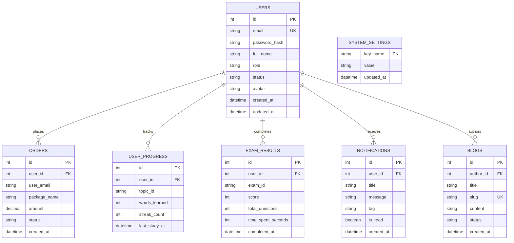

# EngWithMe Enterprise - Relational Database Schema & Data Dictionary

## 1. Overview

The **EngWithMe** relational database schema is deployed on **Cloudflare D1** (Serverless Distributed SQLite Engine) for Edge API operation, with mirrored compatibility for local MySQL/MariaDB development environments.

All tables enforce strict referential integrity, UTF-8 character encoding (`utf8mb4`), and indexed lookup fields to achieve sub-millisecond query execution speeds.

---

## 2. Entity Relationship Diagram (ERD)



---

## 3. Detailed Data Dictionary

### 3.1. Table: `users` (Account Credentials & Profile)
Primary entity storing student, manager, and administrator account details.

| Column | Type | Constraints | Description |
| :--- | :--- | :--- | :--- |
| `id` | `INTEGER` | `PRIMARY KEY AUTOINCREMENT` | Unique user identifier |
| `email` | `VARCHAR(255)` | `UNIQUE`, `NOT NULL` | User primary email address |
| `password_hash` | `VARCHAR(255)` | `NULLABLE` | Bcrypt hashed password (NULL for Google OAuth) |
| `full_name` | `VARCHAR(150)` | `NOT NULL` | Full display name |
| `role` | `VARCHAR(20)` | `DEFAULT 'user'` | Role: `'user'`, `'manager'`, `'admin'` |
| `status` | `VARCHAR(20)` | `DEFAULT 'active'` | Status: `'active'`, `'locked'` |
| `avatar` | `VARCHAR(500)` | `NULLABLE` | Profile picture URL |
| `created_at` | `DATETIME` | `DEFAULT CURRENT_TIMESTAMP` | Registration timestamp |
| `updated_at` | `DATETIME` | `DEFAULT CURRENT_TIMESTAMP` | Last modification timestamp |

---

### 3.2. Table: `orders` (Subscriptions & Transactions)
Stores course package purchases, VIP enrollments, and payment transaction logs.

| Column | Type | Constraints | Description |
| :--- | :--- | :--- | :--- |
| `id` | `INTEGER` | `PRIMARY KEY AUTOINCREMENT` | Transaction ID |
| `user_id` | `INTEGER` | `FOREIGN KEY (users.id)` | Owner user ID |
| `user_email` | `VARCHAR(255)` | `NOT NULL` | Email associated with order |
| `package_name` | `VARCHAR(100)` | `NOT NULL` | Package name (e.g. `'PRO_TOEIC_FULL'`) |
| `amount` | `DECIMAL(10,2)` | `NOT NULL` | Payment amount in VND |
| `status` | `VARCHAR(20)` | `DEFAULT 'completed'` | Status: `'pending'`, `'completed'`, `'refunded'` |
| `created_at` | `DATETIME` | `DEFAULT CURRENT_TIMESTAMP` | Order timestamp |

---

### 3.3. Table: `user_progress` (Vocabulary & Study Metrics)
Tracks learning statistics, word mastery count, and daily streaks per student.

| Column | Type | Constraints | Description |
| :--- | :--- | :--- | :--- |
| `id` | `INTEGER` | `PRIMARY KEY AUTOINCREMENT` | Record ID |
| `user_id` | `INTEGER` | `FOREIGN KEY (users.id)` | Student ID |
| `topic_id` | `VARCHAR(100)` | `NOT NULL` | Topic slug (e.g., `'animals'`, `'business'`) |
| `words_learned` | `INTEGER` | `DEFAULT 0` | Total words mastered in topic |
| `streak_count` | `INTEGER` | `DEFAULT 0` | Consecutive study days |
| `last_study_at` | `DATETIME` | `NULLABLE` | Last active study timestamp |

---

### 3.4. Table: `exam_results` (TOEIC Practice Test Scores)
Stores completed examination attempts, score breakdown, and time metrics.

| Column | Type | Constraints | Description |
| :--- | :--- | :--- | :--- |
| `id` | `INTEGER` | `PRIMARY KEY AUTOINCREMENT` | Result ID |
| `user_id` | `INTEGER` | `FOREIGN KEY (users.id)` | Student ID |
| `exam_id` | `VARCHAR(100)` | `NOT NULL` | Exam slug/identifier |
| `score` | `INTEGER` | `NOT NULL` | Total score achieved |
| `total_questions` | `INTEGER` | `NOT NULL` | Total exam questions |
| `time_spent_seconds`| `INTEGER` | `NOT NULL` | Duration in seconds |
| `completed_at` | `DATETIME` | `DEFAULT CURRENT_TIMESTAMP` | Exam completion date |

---

### 3.5. Table: `notifications` (Broadcast & Individual Alerts)
Stores system maintenance alerts, announcements, and user notifications.

| Column | Type | Constraints | Description |
| :--- | :--- | :--- | :--- |
| `id` | `INTEGER` | `PRIMARY KEY AUTOINCREMENT` | Notification ID |
| `user_id` | `INTEGER` | `NULLABLE` | Target user ID (NULL for Broadcast All) |
| `title` | `VARCHAR(255)` | `NOT NULL` | Notification title |
| `message` | `TEXT` | `NOT NULL` | Main message content |
| `tag` | `VARCHAR(50)` | `DEFAULT 'system'` | Tag: `'system'`, `'promo'`, `'reminder'` |
| `is_read` | `BOOLEAN` | `DEFAULT 0` | Read flag (0 = unread, 1 = read) |
| `created_at` | `DATETIME` | `DEFAULT CURRENT_TIMESTAMP` | Creation date |

---

### 3.6. Table: `blogs` (Community & Articles)
Stores blog articles, educational guides, and community publications.

| Column | Type | Constraints | Description |
| :--- | :--- | :--- | :--- |
| `id` | `INTEGER` | `PRIMARY KEY AUTOINCREMENT` | Article ID |
| `author_id` | `INTEGER` | `FOREIGN KEY (users.id)` | Author user ID |
| `title` | `VARCHAR(255)` | `NOT NULL` | Article title |
| `slug` | `VARCHAR(255)` | `UNIQUE`, `NOT NULL` | URL friendly slug |
| `content` | `TEXT` | `NOT NULL` | Markdown/HTML body content |
| `status` | `VARCHAR(20)` | `DEFAULT 'pending'` | Status: `'pending'`, `'approved'`, `'rejected'` |
| `created_at` | `DATETIME` | `DEFAULT CURRENT_TIMESTAMP` | Publication date |

---

## 4. DDL Migration Scripts

```sql
-- SQLite / Cloudflare D1 Full Database DDL Schema

CREATE TABLE IF NOT EXISTS users (
    id INTEGER PRIMARY KEY AUTOINCREMENT,
    email TEXT UNIQUE NOT NULL,
    password_hash TEXT,
    full_name TEXT NOT NULL,
    role TEXT DEFAULT 'user',
    status TEXT DEFAULT 'active',
    avatar TEXT,
    created_at DATETIME DEFAULT CURRENT_TIMESTAMP,
    updated_at DATETIME DEFAULT CURRENT_TIMESTAMP
);

CREATE TABLE IF NOT EXISTS orders (
    id INTEGER PRIMARY KEY AUTOINCREMENT,
    user_id INTEGER,
    user_email TEXT NOT NULL,
    package_name TEXT NOT NULL,
    amount REAL NOT NULL,
    status TEXT DEFAULT 'completed',
    created_at DATETIME DEFAULT CURRENT_TIMESTAMP,
    FOREIGN KEY(user_id) REFERENCES users(id) ON DELETE CASCADE
);

CREATE TABLE IF NOT EXISTS user_progress (
    id INTEGER PRIMARY KEY AUTOINCREMENT,
    user_id INTEGER NOT NULL,
    topic_id TEXT NOT NULL,
    words_learned INTEGER DEFAULT 0,
    streak_count INTEGER DEFAULT 0,
    last_study_at DATETIME,
    FOREIGN KEY(user_id) REFERENCES users(id) ON DELETE CASCADE
);

CREATE TABLE IF NOT EXISTS exam_results (
    id INTEGER PRIMARY KEY AUTOINCREMENT,
    user_id INTEGER NOT NULL,
    exam_id TEXT NOT NULL,
    score INTEGER NOT NULL,
    total_questions INTEGER NOT NULL,
    time_spent_seconds INTEGER NOT NULL,
    completed_at DATETIME DEFAULT CURRENT_TIMESTAMP,
    FOREIGN KEY(user_id) REFERENCES users(id) ON DELETE CASCADE
);

CREATE TABLE IF NOT EXISTS notifications (
    id INTEGER PRIMARY KEY AUTOINCREMENT,
    user_id INTEGER,
    title TEXT NOT NULL,
    message TEXT NOT NULL,
    tag TEXT DEFAULT 'system',
    is_read INTEGER DEFAULT 0,
    created_at DATETIME DEFAULT CURRENT_TIMESTAMP,
    FOREIGN KEY(user_id) REFERENCES users(id) ON DELETE CASCADE
);

CREATE TABLE IF NOT EXISTS blogs (
    id INTEGER PRIMARY KEY AUTOINCREMENT,
    author_id INTEGER NOT NULL,
    title TEXT NOT NULL,
    slug TEXT UNIQUE NOT NULL,
    content TEXT NOT NULL,
    status TEXT DEFAULT 'pending',
    created_at DATETIME DEFAULT CURRENT_TIMESTAMP,
    FOREIGN KEY(author_id) REFERENCES users(id) ON DELETE CASCADE
);

CREATE TABLE IF NOT EXISTS system_settings (
    key_name TEXT PRIMARY KEY,
    value TEXT NOT NULL,
    updated_at DATETIME DEFAULT CURRENT_TIMESTAMP
);

-- Indexing for Query Optimization
CREATE INDEX IF NOT EXISTS idx_users_email ON users(email);
CREATE INDEX IF NOT EXISTS idx_users_role_status ON users(role, status);
CREATE INDEX IF NOT EXISTS idx_orders_user ON orders(user_id);
CREATE INDEX IF NOT EXISTS idx_orders_email ON orders(user_email);
CREATE INDEX IF NOT EXISTS idx_progress_user ON user_progress(user_id);
CREATE INDEX IF NOT EXISTS idx_exam_user ON exam_results(user_id);
