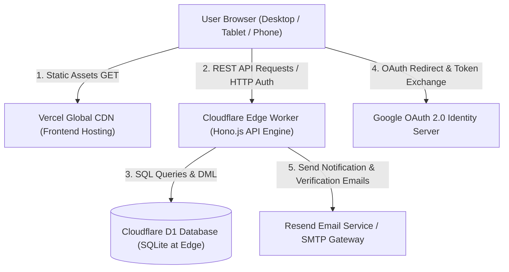
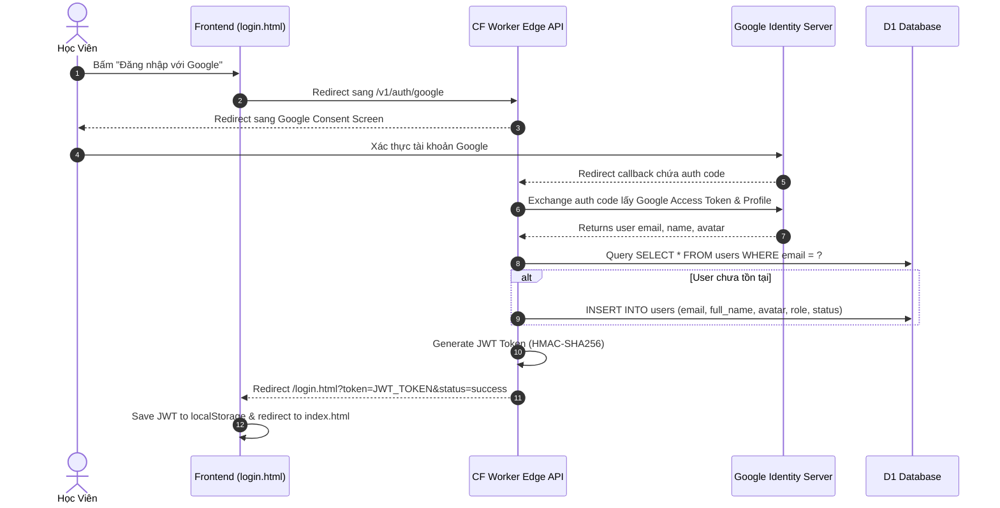

# EngWithMe Enterprise - Architectural Specifications & Design Blueprint

## 1. System Overview

**EngWithMe** is an enterprise-grade English Learning Platform built for high speed, low latency, and global scale. It combines a zero-dependency, highly responsive Frontend (HTML5, Vanilla CSS Design System, Modular JavaScript) with an Edge Serverless Micro-backend powered by **Cloudflare Workers (Hono.js)** and **Cloudflare D1 SQLite Database**, deployed globally across Cloudflare's Edge CDN network.

---

## 2. Technology Stack & Component Responsibilities

### 2.1. Frontend Architecture
* **Core Technologies**: HTML5, Vanilla CSS3 (Custom Glassmorphic Design System), ES6+ JavaScript.
* **Hosting Platform**: Vercel Production Deployment (`https://engwithme.tungf.io.vn`).
* **Design System**: High-contrast Dark Mode, CSS Custom Properties (`var(--*)`), Glassmorphic Translucency, Flexbox/Grid relative layout engine without external framework bloat.
* **Routing & State**: Single-Page & Multi-Page Hybrid Engine with client-side state caching in `localStorage` & `sessionStorage`.

### 2.2. Edge Backend Architecture
* **Runtime**: Cloudflare Workers (V8 JavaScript/TypeScript Serverless Edge Engine).
* **Framework**: Hono.js `^4.0` (Lightweight, ultra-fast web framework optimized for Cloudflare Workers).
* **Database**: Cloudflare D1 (Global distributed Serverless Relational Database built on SQLite).
* **Security & Auth**: JWT (JSON Web Tokens) with HMAC-SHA256 signatures, Bcrypt Password Hashing (`bcryptjs`), Google OAuth 2.0 Identity Federation.
* **Email Dispatch**: Resend API (HTTP REST Email Delivery) + Legacy Gmail SMTP Support.

---

## 3. Core Authentication & Data Flow

### 3.1. Google OAuth 2.0 Federated Login Flow

---

## 4. Subsystem Modules

### 4.1. Admin Management Workspace (`/admin.html`)
* **Accounts Management**: Real-time user listing, search, role assignment (`admin`, `manager`, `user`), status toggling (`active`, `locked`).
* **Cascade Delete Engine**: 100% clean account removal purging linked `orders`, `user_progress`, `exam_results`, `notifications`, `blogs`.
* **System Stats KPI Bar**: 4-card metric dashboard tracking Total Users, Learners, Active Accounts, and Today's Registrations.

### 4.2. Vocabulary Learning Engine (`/vocabulary_study.html`)
* **Study Modes**:
  1. **Flashcard Mode**: Interactive flip cards with pronunciation audio & phonetic guides.
  2. **Quiz Mode**: 4-option multiple choice vocabulary selection.
  3. **Matching Game (Mode Play)**: 16-tile interactive 1.5x magnified matching grid.
  4. **Typing & Listening Practice**: Audio dictation and spelling verification.

### 4.3. Exam & Practice Module (`/quiz.html`)
* Full TOEIC Listening & Reading simulation tests.
* Timer tracking, real-time question navigation, automatic score computation & feedback.

---

## 5. Non-Functional Requirements & Security Protocols

1. **Latency Target**: Sub-50ms Edge Response Time across ASIA/GLOBAL nodes.
2. **Data Isolation**: CORS restriction configured for production domain `https://engwithme.tungf.io.vn`.
3. **Password Security**: Bcrypt with minimum 10 salt rounds.
4. **Token Security**: Expiration enforced via JWT claims (`exp`), stored securely in `localStorage` with automated HTTP bearer injection.
